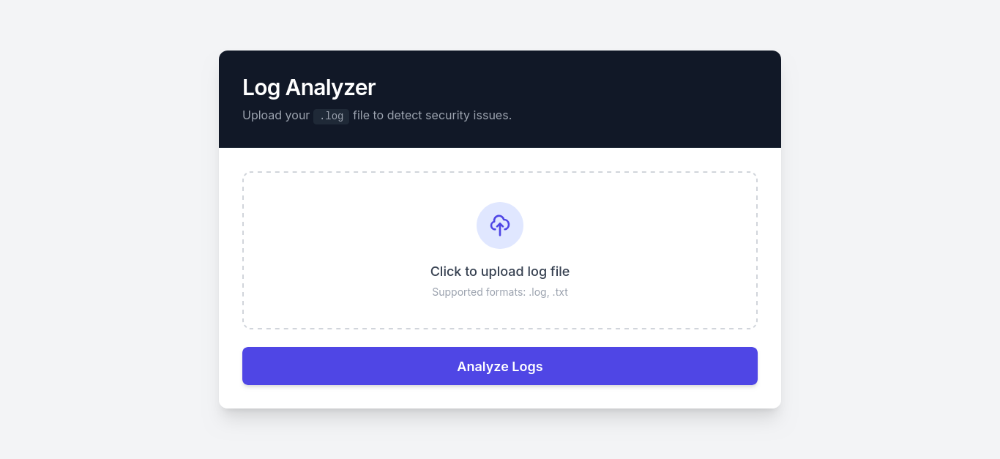

# Log Analyzer

Paste your logs, get a summary of errors and what to fix.

Uses OpenAI to analyze any log format and find issues.

## Quick Start

### With Docker (recommended)

```bash
export OPENAI_API_KEY="your-openai-key"
docker compose up
```

Open http://localhost:8000

### Local

```bash
uv sync
export OPENAI_API_KEY="your-openai-key"
uv run uvicorn app.api.routes:app --reload
```

Open http://127.0.0.1:8000

## How it works

1. Upload a log file
2. App reads the last 500 lines (saves tokens)
3. Sends to OpenAI with your logs
4. Gets back a list of errors with severity and fixes

## Screenshots

Upload form:


Analysis output:


## Requirements

- OpenAI API key (get one at openai.com)
- Docker (optional)

## File Structure

```
app/
├── api/routes.py       # Web server endpoints
├── config.py           # OpenAI settings
├── main.py             # File reading and orchestration
└── utils/llm_analyzer.py # Calls OpenAI API
```
